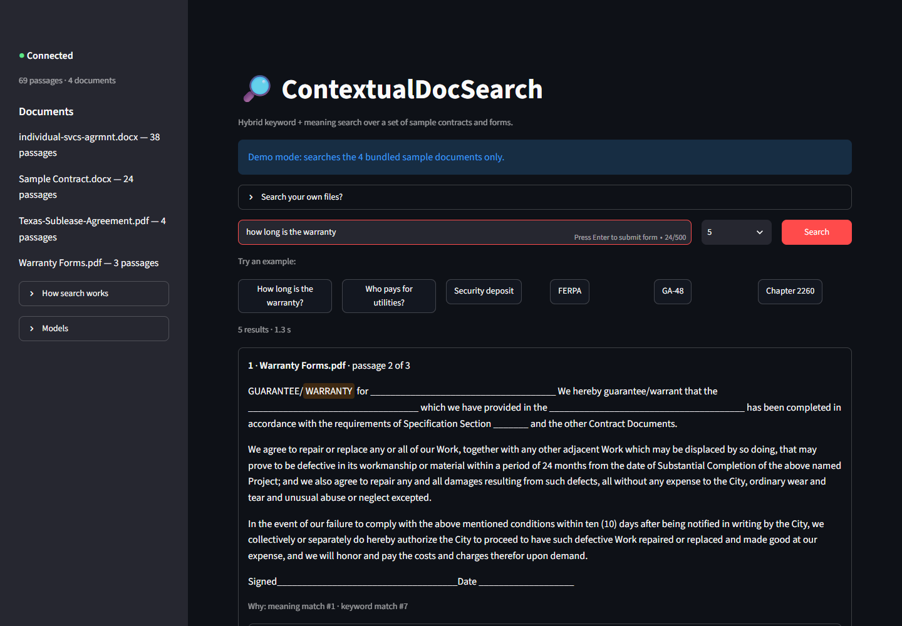
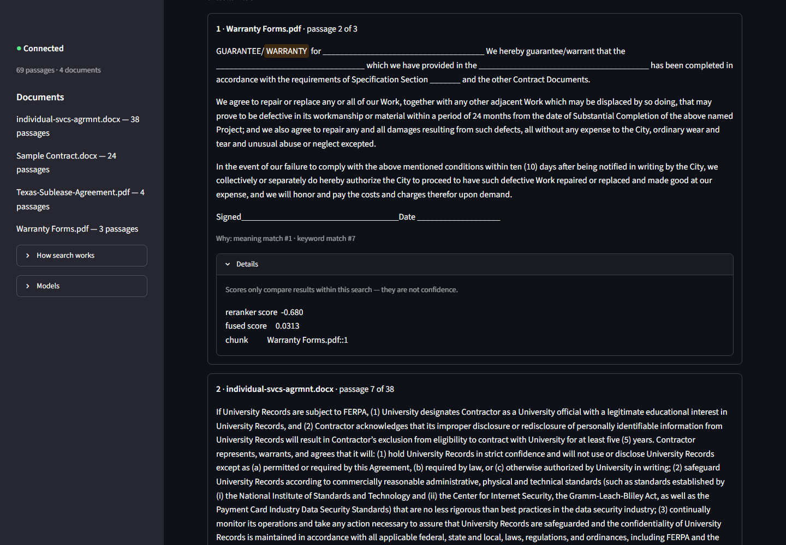

# ContextualDocSearch

Search a set of contracts and forms by **what you mean**, not just the words you type.

Ask *"how long is the warranty?"* and it finds the clause that says *"…defective in
its workmanship or material within a period of 24 months…"*, even though the two
share almost no words. Type an exact reference such as `FERPA` or `GA-48` and it
finds that too.



It runs **entirely on your own machine**: the AI models run locally, nothing is sent
to an external service, and the page is reachable only from your computer. It
searches the four sample documents bundled in [`data/sample_docs/`](data/sample_docs/)
and nothing else. This is v1, a local demo; it is not packaged for hosting.

---

## Quick start

You need **Python 3.11 or newer** and about 3 GB of free disk space. The AI
libraries include PyTorch.

**1. Install**

```bash
git clone https://github.com/khatan498/ContextualDocSearch.git
cd ContextualDocSearch

python -m venv .venv
.venv\Scripts\Activate.ps1          # macOS/Linux: source .venv/bin/activate

pip install -r requirements.txt
```

**2. Build the search index** (one time)

```bash
python scripts/build_index.py
```

This reads the sample documents, splits them into 69 passages, and indexes them.
The first run downloads the embedding model (~440 MB). After that, everything loads
from your local cache.

**3. Start the app**

```bash
python scripts/run_local.py
```

Your browser opens the search page at **http://127.0.0.1:8501** after about ten
seconds, while the models load. The first start also downloads the reranking model
(~90 MB).

**4. Stop it** with **Ctrl+C** in the terminal. That stops everything the command
started.

No configuration is needed; every setting has a working default. To change one, copy
`.env.example` to `.env` and edit it (see [Configuration](#configuration)).

---

## Using the search page

- **Search box.** Type a question or a term and press Enter. The selector next to it
  sets how many results you get (3, 5 or 10).
- **Example buttons.** One click runs a ready-made search. They show off both halves
  of the search: *meaning* ("How long is the warranty?", "Who pays for utilities?")
  and *exact terms* ("FERPA", "GA-48", "Chapter 2260").
- **Result cards.** Each shows the document, which passage of it ("passage 2 of 3"),
  and the passage itself with your search words highlighted.
- **"Why" line.** Under each card, in plain words, which half of the search found the
  passage and how highly it ranked it: *meaning match #1 · keyword match #7*.
- **Details.** Opens the raw scores. They only compare results within one search and
  say nothing about whether the answer is right, which is why they are tucked away.
- **Sidebar.** Whether the search service is connected, the four documents with their
  passage counts, a short "How search works", and the models in use.



Search always returns its closest passages, even for a question the documents can't
answer. The note under the results says so, and it's worth keeping in mind.

If something is wrong, the app tells you rather than crashing. For example:

| You see | What to do |
|---|---|
| "No search index … Run python scripts/build_index.py first" | Build the index (step 2) |
| "port 8501 is already in use" | Close the other copy, or set `UI_PORT` in `.env` |
| "The index was built with … but EMBEDDING_MODEL_NAME is …" | You changed the model: rebuild the index |
| The page says the search service isn't running | Start the app with `python scripts/run_local.py` |

**Rebuilt the index?** Restart the app so it loads the new one.

---

## Other ways to search

### From the command line

```bash
python scripts/search.py "how long is the warranty"
python scripts/search.py "termination notice period" -k 3
```

```
   1   -0.680  Warranty Forms.pdf#1               vec  #1  bm25  #7  GUARANTEE/WARRANTY for ______...
   2   -4.159  individual-svcs-agrmnt.docx#6      vec #11  bm25   -  If University Records are sub...
   3   -4.513  Sample Contract.docx#3             vec  #5  bm25   -  Contractor will submit invoic...
```

`vec` and `bm25` are where the meaning search and the keyword search each placed the
passage (`-` means that half didn't shortlist it).

### Over HTTP

The page talks to a small JSON API, which you can also run and call on its own:

```bash
python scripts/serve.py            # http://127.0.0.1:8000, interactive docs at /docs
```

```bash
curl -X POST http://127.0.0.1:8000/search \
     -H "Content-Type: application/json" \
     -d '{"query": "how long is the warranty", "top_k": 3}'
```

| Endpoint | Returns |
|---|---|
| `POST /search` | Ranked passages for `{"query": ..., "top_k": ...}` |
| `GET /health` | Whether it's ready, the passage count, and the models in use |
| `GET /documents` | Each searchable document and its passage count |

The query goes in the request body rather than the URL on purpose: servers log URLs,
so a URL-based API would write every search into the log.

---

## How it works

Every search runs the same two stages:

```
                ┌─ keyword search (BM25) ─── top 20 ─┐
your question ──┤                                    ├─ merge by rank ─ reranker ─ results
                └─ meaning search (vectors) ─ top 20 ─┘
```

1. **Shortlist.**
   - **Keyword search** (BM25) finds passages containing your words. It is exact, so
     it finds codes like `GA-48` that meaning search blurs.
   - **Meaning search** compares *embeddings*, lists of numbers that place text so
     similar meanings sit close together, so it finds the warranty clause from a
     question that shares none of its words.
2. **Merge.** The two shortlists are combined by **rank**, not score (*reciprocal rank
   fusion*): a passage both halves rate highly rises to the top. Their scores are on
   different scales and are never compared directly.
3. **Rerank.** A *cross-encoder* reads each shortlisted passage together with your
   question and puts them in final order. It is slower but more accurate, which is
   why it only sees the shortlist.

Neither half is enough alone. For "how long is the warranty", keyword search ranks an
unrelated clause first, dragged there by "how", "long" and "the". Meaning search gets
it right, and merging the two fixes the ranking. A test pins this example.

Before searching, the documents are split into overlapping passages of up to 480
tokens (roughly 350 words). The embedding model reads at most 512 tokens and
silently ignores anything longer, so passage size is checked against it.

---

## Configuration

Settings come from environment variables, or from a `.env` file in the project
folder. Copy [`.env.example`](.env.example), which explains each one. The ones you're
most likely to touch:

| Setting | Default | What it does |
|---|---|---|
| `SEARCH_TOP_K` | `5` | Results per search when none is chosen |
| `RETRIEVAL_CANDIDATES` | `20` | Passages each half shortlists. Fewer means faster but may miss the answer |
| `UI_PORT`, `API_PORT` | `8501`, `8000` | Where the page and the API listen |
| `API_HOST` | `127.0.0.1` | Set `0.0.0.0` only if you deliberately want the API reachable from your network |
| `EMBEDDING_MODEL_NAME` | `BAAI/bge-base-en-v1.5` | Changing it means rebuilding the index |
| `RERANKER_MODEL_NAME` | `cross-encoder/ms-marco-MiniLM-L6-v2` | Can change without a rebuild |
| `CHUNK_MIN_TOKENS`, `CHUNK_MAX_TOKENS` | `350`, `480` | Passage size. Rebuild after changing |

`APP_MODE=personal` is recognised but not implemented. The app refuses to start and
explains that a future release will let you connect your own cloud drives (Google
Drive, OneDrive) to search your own files.

---

## Privacy

- **Nothing leaves your machine.** Both AI models run locally. The only network
  traffic is the one-time model downloads from Hugging Face. After that, models load
  strictly from the local cache; left to their defaults, they would check online for
  updates on every start.
- **Nothing is reachable from your network.** The page and the API listen on
  `127.0.0.1` only.
- **No telemetry.** Streamlit's usage statistics and Chroma's telemetry are both
  switched off. Streamlit sends usage statistics by default. Its "Deploy" button,
  for publishing apps to Streamlit's cloud, is hidden too.
- **Searches aren't logged.** Queries travel in request bodies, never in URLs.
- **Only the sample documents are read.** There is no upload, no cloud connector, and
  no access to your own files.

---

## Known issues

- **Search can't tell you when there's no good answer.** It always returns its
  closest passages, and the reranker's scores can't separate a real match from a
  nonsense query.
- **Scanned PDFs yield nothing.** There is no OCR. A PDF with broken text encoding
  can also produce garbled text without any warning.
- **Word documents lose their order.** Text from tables is extracted after the
  paragraphs, not where it appeared.
- **Some encrypted PDFs are skipped.** Files locked only against printing are read if
  they use the older RC4 encryption. AES-encrypted ones are skipped with a message.
- **Restart after rebuilding the index.** A running app keeps the index it started
  with.
- **A force-killed launcher leaves the app running.** Ctrl+C or closing the terminal
  stops everything. Ending only the launcher from Task Manager leaves the API and
  page on ports 8000/8501; end the `python` processes too.
- **Packaging.** There's no `pyproject.toml`, `requirements.txt` has no upper
  version bounds, and there's no CI yet.

---

## For developers

### Tests

```bash
pytest                    # 576 tests, about 20 seconds, fully offline
pytest -m integration     # 7 more that load the real models and read the built index
```

The default run needs no network and no built index. The models are replaced by
stubs, but Chroma and BM25 are real, so ranking behaviour is genuinely tested. The
search page is tested headlessly with Streamlit's `AppTest` against a fake API
client. Every source file is also parsed with the Python 3.11 grammar, so newer
syntax can't slip in from a newer development machine.

### Project layout

```
app/
├── config.py                typed settings, read from .env
├── modes.py                 demo/personal mode and its message
├── cli.py                   shared command-line helpers
├── model_cache.py           cache-first model loading (no network once cached)
├── ingestion/               find documents, extract text, split into passages
├── indexing/                embeddings, the vector store (Chroma), the BM25 index
├── retrieval/               rank fusion, reranking, the search pipeline
├── api/                     FastAPI app, request/response models, body-size limit
└── ui/                      the page's API client and text rendering
ui/streamlit_app.py          the search page
scripts/                     build_index.py, search.py, serve.py, run_local.py
data/sample_docs/            the four bundled documents
data/index/                  the built index (not committed; rebuild any time)
```

[`CLAUDE.md`](CLAUDE.md) records the project's rules and the reasoning behind its
design decisions, with measurements.

<details>
<summary><b>Design decisions worth knowing</b></summary>

- **Two stages, one path.** Fusion aims for recall (get the right passage into a
  shortlist of 20–40); the cross-encoder aims for precision, but runs once per
  passage per search, so it only sees the shortlist. No code path returns unfused or
  unreranked results.
- **Rank, not score.** Cosine similarity lives in [-1, 1]; BM25 is unbounded and
  corpus-dependent. Reciprocal rank fusion never compares them.
- **Passages are measured with the model's own tokenizer.** A word-count estimate
  under-counts by 44–74% on tables, dates and reference numbers, exactly the text
  that must not be silently cut off.
- **The truncation guard.** `CHUNK_MAX_TOKENS` defaults to 480, under the embedding
  model's 512, and the app refuses to build if it's set higher.
- **The index records its embedding model.** Search refuses an index built with a
  different model: vectors from two models aren't comparable, and two models of the
  same size would otherwise return confident nonsense without any error.
- **Refuse, don't half-start.** Every script checks configuration and the index
  before doing work, and exits with a message: 1 for index problems, 2 for
  configuration.
- **Passage text is escaped before display.** Streamlit's markdown treats `$` as the
  start of a LaTeX formula, and contracts are full of dollar amounts.

</details>

<details>
<summary><b>Why this reranker</b></summary>

Three cross-encoders were measured on 12 queries whose answer passage can be picked
out by its text:

| Reranker | Top result holds the answer | Search time (CPU) | Download |
|---|---|---|---|
| `cross-encoder/ms-marco-MiniLM-L6-v2` (default) | 12/12 | 0.65–1.3 s | 90 MB |
| `BAAI/bge-reranker-base` | 10/12 | 4.6–7.8 s | 1.1 GB |
| `BAAI/bge-reranker-v2-m3` | 12/12 | 13–29 s | 2.3 GB |

`v2-m3` never truncates long passages but is only practical with a GPU. The test set
is small: it separates bad from good, not good from better.

</details>

<details>
<summary><b>Build and diagnostic output</b></summary>

```
$ python scripts/build_index.py
individual-svcs-agrmnt.docx       38 chunks
Sample Contract.docx              24 chunks
Texas-Sublease-Agreement.pdf       4 chunks
Warranty Forms.pdf                 3 chunks

chunks : 69  (largest 480 tokens)
```

`python scripts/build_index.py --verify "how long is the warranty"` shows what each
half of the search finds on its own, before merging. It shows why the app is hybrid:

```
  vector index (cosine similarity, 1.0 = identical)
      0.580  Warranty Forms.pdf#1  GUARANTEE/WARRANTY for ______________ We hereby...
  keyword index (BM25 score, corpus-relative)
      7.856  individual-svcs-agrmnt.docx#33  THIS IS AN EXAMPLE ONLY. Please contact...
```

</details>

---

## License

Not yet licensed. Until a `LICENSE` file is added, default copyright applies and no
permission is granted for reuse.
